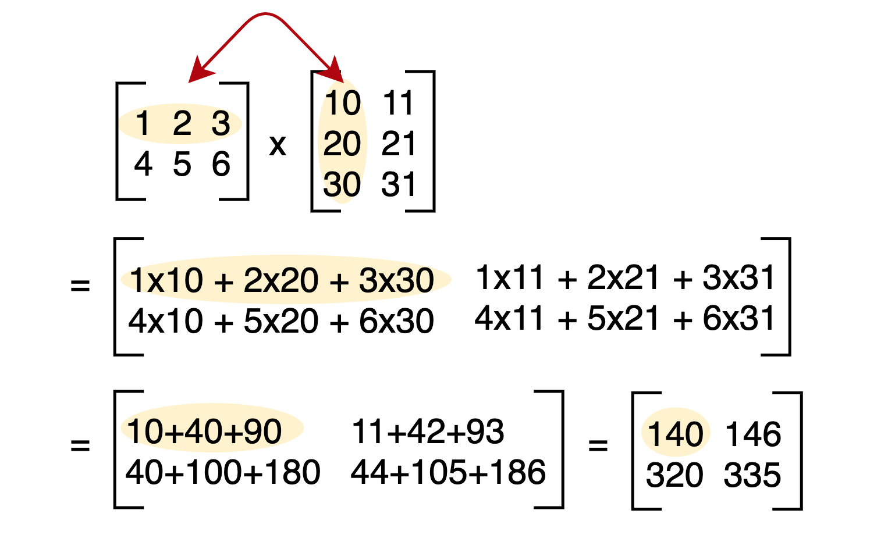

# Create Naive Multiplication in C  matrix by matrix

To multiply two matrices, we need to follow set of rules. we have two matrices A and B, with dimensions m x n and n x p, respectively. The resulting matrix C will have dimensions m x p.

Here’s how to calculate the elements of C:

For each element in the resulting matrix C, take the dot product of the corresponding row in matrix A and the corresponding column in matrix B.
Add up the products from step 1 to get the value of the element in C.

- [ ] 1
- [x] 2
- [ ] 3

---
[CheatSheet](https://www.markdownguide.org/cheat-sheet/)



```c
printf('HolaMundo!');
```
