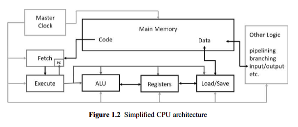
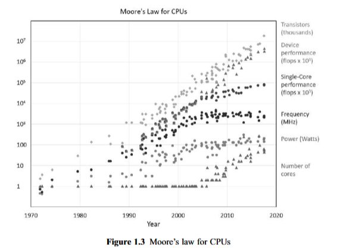
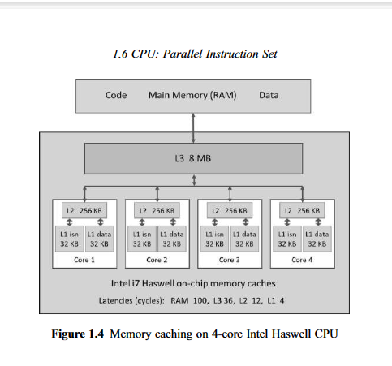
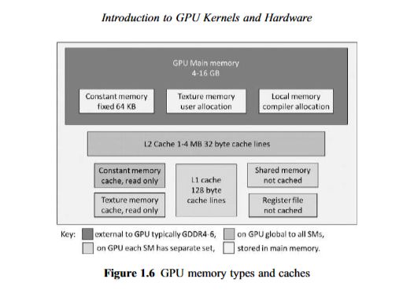
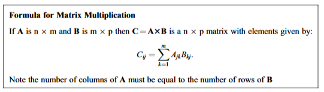

# Resume Of Professional CUDA C Programming Chptrs 3-4

## Overall Overview
**Chapter 3:** focuses on the CUDA execution model and the common limiters to kernel performance, such as memory bandwidth, compute resources, and instruction and memory latency. It emphasizes the importance of understanding hardware resources to improve kernel performance.

**Chapter 4:** delves into the topic of global memory in CUDA programming. It explains the CUDA memory model and explores different global memory access patterns. The chapter also covers memory management, memory allocation and deallocation, memory transfer, and performance tuning techniques related to global memory.

## Overall Key points
### Chapter 3:
- The CUDA execution model has three common limiters to kernel performance: memory bandwidth, compute resources, and instruction and memory latency.
- Understanding hardware resources is crucial for optimizing kernel performance.
- Knowledge of the GPU architecture enables better code writing and utilization of device capabilities.

### Chapter 4:
- The CUDA memory model unifies host and device memory systems and allows explicit control over data placement for optimal performance.
- Applications often exhibit temporal and spatial locality, which can be leveraged for efficient memory access.
- The chapter covers various global memory access patterns, including aligned and coalesced access, and discusses performance tuning techniques for maximizing memory bandwidth.

## Chapter 3: Kuda Execution Model
3.1 Introducing the CUDA Execution Model  
The CUDA execution model provides an operational view of how instructions are executed on a specific computing architecture. It exposes an abstract view of the GPU parallel architecture, allowing developers to reason about thread concurrency. The execution model consists of two primary abstractions: a memory hierarchy and a thread hierarchy. The memory hierarchy allows for efficient memory accesses, while the thread hierarchy enables control over the massively parallel GPU.

3.2 Understanding The Nature of Warp Execution  
In this section, the document explains the concept of warp execution in detail. It starts by introducing the idea of warps, which are groups of 32 threads that are executed together on a single execution unit called a Streaming Multiprocessor (SM). The document emphasizes that while threads within a warp are logically executed in parallel, not all threads can physically execute in parallel at the same time.

3.3 Exposing Parallelism  
It explains that dynamic parallelism allows for the creation of new work directly from the GPU, enabling the expression of recursive or data-dependent parallel algorithms in a more natural and easy-to-understand way. The document also mentions that attention must be given to the child grid launch strategy, parent-child synchronization, and the depth of nested levels when implementing an efficient nested kernel. It highlights that the maximum number of kernel nestings will likely be limited due to the device runtime system reserving extra memory at each nesting level. The document emphasizes the importance of synchronization for both performance and correctness and suggests that reducing the number of in-block synchronizations can lead to more efficient nested kernels. It concludes by stating that dynamic parallelism offers the ability to adapt to data-driven decisions or workloads by making launch configuration decisions at runtime on the device.

3.4 Avoid Branch Divergence  
Branch divergence refers to the situation where threads within a warp take different code paths. When threads in a warp diverge, the warp serially executes each branch path, disabling threads that do not take that path. This can result in degraded performance as the amount of parallelism within the warp is reduced.

3.5 Unrolling Loops  
Loop unrolling is a technique used to improve the performance of loops in CUDA programming. It involves replicating the body of the loop multiple times, reducing the number of iterations and improving instruction throughput. Unrolling loops can be effective for sequential array processing loops where the number of iterations is known prior to execution.

3.6 Dynamic Paralellism  
Dynamic Parallelism is a feature introduced in CUDA that allows the GPU to launch new grids dynamically. It enables the GPU to launch nested kernels, eliminating the need for communication with the CPU. With dynamic parallelism, any kernel can launch another kernel and manage any inter-kernel dependencies needed to perform additional work.

## Chapter 4: Global Memory
4.1 Introducing the CUDA memory model  
The CUDA memory model is a key aspect of programming with CUDA. It unifies the separate host and device memory systems and exposes the full memory hierarchy, allowing programmers to explicitly control data placement for optimal performance. The memory model provides a way to manage memory access and achieve optimal latency and bandwidth given the hardware memory subsystem.

4.2 Memory Management  
The CUDA memory model provides a unified memory hierarchy that allows explicit control over data placement for optimal performance. Memory management plays a crucial role in high-performance computing on modern accelerators. The memory hierarchy consists of separate host and device memory systems, and the CUDA memory model exposes this hierarchy to the programmer.

4.3 Memory Access Patterns  
Optimizing memory access patterns is crucial for maximizing global memory throughput and improving kernel performance. Aligned and coalesced memory accesses are preferred, especially for cached loads and global memory writes, as they minimize wasted bandwidth and maximize bus utilization.

4.4 What bandwidth Can a Kernel Achieve  
this section provides insights into the factors affecting kernel performance, such as memory latency, memory bandwidth, block size, and different transpose techniques. It emphasizes the importance of optimizing these factors to achieve the best possible bandwidth for a kernel.

4.5 Matrix Addition with unified memory  
Unified Memory is a feature introduced in CUDA 6.0 that simplifies memory management in the CUDA programming model. It creates a pool of managed memory that can be accessed by both the CPU and GPU using the same memory address. This eliminates the need for explicit memory copies and allows for easier management of memory allocations.

## Further Chapter 3 Explanation
### 3.1.1 GPU Architectur Overview:
The GPU architecture is built around a scalable array of Streaming Multiprocessors (SM). Each SM is designed to support concurrent execution of hundreds of threads. When a kernel grid is launched, the thread blocks of that kernel grid are distributed among available SMs for execution. The GPU architecture also employs a Single Instruction Multiple Thread (SIMT) architecture to manage and execute threads in groups of 32 called warps. All threads in a warp execute the same instruction at the same time. The Fermi architecture, in particular, features up to 512 accelerator cores called CUDA cores and has six 384-bit GDDR5 DRAM memory interfaces supporting up to a total of 6 GB of global on-board memory.

### 3.1.2 The Fermi Architecture:

The first CUDA example in the document demonstrates the use of CUDA to evaluate the integral of sin(x) from 0 to π using the trapezoidal rule. The code calculates the sum of a large number of equally spaced evaluations of the function within the given range. The number of steps and terms in the Taylor series used to evaluate sin(x) are represented by the variables "steps" and "terms" respectively. The example showcases the ability of CUDA to run thousands of simultaneous threads, providing a potential speed-up compared to a single CPU thread.

### 3.1.3 the Kepler Architecture:

- Master Clock: The master clock acts as a conductor, sending clock pulses at a fixed frequency to each unit of the CPU. The processing speed of the CPU is directly proportional to this frequency.
- Memory: The main memory holds both the program data and the machine code instructions. It is where the CPU retrieves and stores data during its operations.
- Registers: The register file contains a small amount of high-speed memory that the CPU uses to store and manipulate data during its operations.
- Von Neumann vs. Harvard Architecture: Computers with von Neumann architecture store instructions and data in a common memory, while Harvard architecture uses separate hardware to store data and instructions.
- Program Counter (PC): The program counter keeps track of the memory address of the next instruction to be executed by the CPU.
- Cache: The CPU has multiple levels of caching memories, including L1, L2, and L3 caches. These caches store frequently accessed data to improve performance by reducing the time it takes to retrieve data from the main memory.
- Clock Frequency: The clock frequency determines the speed at which the CPU can execute instructions. Over the years, the clock frequency has increased, but it has reached a limit due to power requirements and heat generation.
- Moore's Law: Moore's Law states that the number of transistors on a chip doubles approximately every two years, leading to increased computational power and performance.

### 3.1.4 Profile-Driven Optimization:

The compute power of individual CPUs has significantly increased over the past 30 years, with a factor of more than 10^6. This growth has been driven by innovations in design rather than an increase in frequency. Multicore technology has been a major contributor to performance per chip since 2002. While GPUs are not included in this plot, recent Intel Xeon-phi designs with hundreds of cores are becoming more GPU-like. The power used by a single device has remained relatively stable since 2002. These advancements in compute power have transformed society and show no signs of slowing down.

### 3.2.1: Warps and thread Blocks

In CPU memory management, latency hiding is achieved through the use of caches. Data and instructions do not move instantly between blocks, but progress clock-step by clock-step through hardware registers, resulting in a latency between issuing a request for data and its arrival. This latency is typically tens of clock-cycles on a CPU. Caches help mitigate the performance impact of latency by exploiting the fact that data stored in sequential physical memory locations are mostly processed sequentially in code. When one element of data is requested, the hardware sends this element and a number of adjacent elements on successive clock-ticks, making successive elements available without additional latency. Memory cache units are employed to buffer data streaming from multiple places in main memory, and there are separate L1 caches for data and instructions. The use of caches helps hide latency and improve overall performance.

### 1.6 CPU: Parallel Instruction Set:

- Intel CPUs have parallel capabilities in the form of vector instructions, starting with the Pentium III SSE instruction set in 1999.
- These vector instructions use registers capable of holding multiple data items, allowing for parallel execution of operations on these items.
- The use of vector instructions, such as SSE, can significantly speed up floating-point calculations by a factor of four or more.
- Over the years, Intel CPUs have evolved to support more advanced vector instructions, such as AVX2 and AVX-512, with wider registers and support for various data types.
- AVX-512, the most recent version, uses 512-byte registers capable of holding vectors of up to 16 floats or 8 doubles.
- The use of AVX and other vector instructions on Intel CPUs is discussed in more detail in Appendix D.

### 1.7 GPU Architecture:

- GPUs were initially designed for high-performance computer graphics in gaming. They were capable of performing a large number of pixel calculations per second, which was not possible with traditional processors. This led to the emergence of gaming cards with dedicated hardware for pixel calculations.
-NVIDIA produces three classes of GPUs: GeForce GTX, GeForce RTX, and Titan. These models are aimed at the gaming market and vary in terms of features and price. The GeForce GTX series is the least expensive among them.

### 1.8 pascal architecture:

The Pascal architecture is used in NVIDIA GPUs and is built up in a hierarchical manner. The basic unit is a compute-core capable of performing basic 32-bit floating point and integer operations. These cores do not have individual program counters. Groups of 32 cores are clustered together to form "warp-engines" which are the basic execution units in CUDA kernel programs. Warp-engines add additional compute resources shared by its cores, including special function units (SFUs) for fast evaluation of transcendental functions and double precision floating point units (FP64). Warp-engines are grouped together to form symmetric multiprocessors (SMs). In Pascal GPUs, warp-engines have eight SFUs and either 16 or one FP64 unit.

### 1.9 GPU Memory Types:

- Main memory: This is the primary memory of the GPU, similar to the main memory of a CPU. It stores the program and data for GPU processing. Data transfers between the CPU and GPU main memory can be relatively slow, so it is recommended to minimize these transfers. However, data in the GPU main memory can be reused by successive kernel calls without reloading.

- Constant Memory: A dedicated 64 KB of GPU main memory is reserved for constant data. Constant memory has a dedicated cache that bypasses the L2 cache, making it fast for reading the same memory location by all threads in a warp.

- Texture and Constant Data: Texture and constant data are stored in the GPU main memory. Although they are read-only on the GPU, they can be written to by the CPU. These types of data can be helpful in certain applications, such as manipulating frames of a movie, where parallel data transfers can occur while the GPU is processing the current frame.

- Shared Memory: Each SM provides between 32 KB and 64 KB of shared memory. If a kernel requires shared memory, the size required can be declared either at kernel launch time or at compile time. Each concurrently executing thread block on an SM gets the same size memory block. Shared memory is important because it is very fast and provides the best way for threads within a thread block to communicate with each other. Recent GPUs have better memory caching, so using shared memory for faster access is less important now. It is important to balance the performance gain from using shared memory against reduced SM occupancy when large amounts of shared memory are needed.

- Register File: Each SM has 64K 32-bit registers which are shared equally by the thread blocks concurrently executing on the SM. This is a very important memory resource. If a thread uses more than 32 registers, the maximum number of thread blocks running on the SM (occupancy) is reduced, potentially harming performance. The NVCC compiler has a switch, --maxrregcount <number>, that can be used to tune overall performance by trading occupancy against thread computational performance.

- Local Memory: Local memory is memory blocks private to each individual executing thread. They are used as overflow storage for local variables in intermediate temporary results when the registers available to a thread are insufficient. Local memory is cached via the L2 and L1 caches, just like other data.

### 1.10 Warps and Waves:

In CUDA, the GPU architecture is reflected in the design and launch of a CUDA kernel. Choosing the right number of threads, Nthreads, is crucial when designing CUDA kernels. The goal is to have as many threads as possible, ideally matching the problem size.

The GPU used in the examples is the RTX 2070, which has 36 SM units (Nsm = 36). Each SM can process two warps of 32 threads (Nwarp = 2). Therefore, for this GPU, Ncores = Nsm × Nwarp × 32 = 2304.

The number of warps per SM has varied over GPU generations. In the early Kepler generation, it peaked at six (192 cores) but fell back to two (64 cores) in the Pascal generation. The performance of many kernels is limited by the number of SMs rather than the number of cores.

The CUDA kernel should be designed to hide latencies in memory accesses and hardware pipelines. The GPU hardware can rapidly switch between threads and use data as soon as it becomes available. This latency hiding feature allows the GPU to efficiently process large numbers of threads.

It is important to note that the size of the thread block should be a multiple of the warp size (currently 32 for all NVIDIA GPUs) up to the maximum size of 1024. Threads within the same thread block can communicate and synchronize with each other using shared or global device memory.

Overall, designing efficient CUDA kernels requires skill and experience, and choosing the right number of threads is a critical factor in achieving optimal performance.

### 1.11 Blocks and Grids:

Blocks and grids are important concepts in CUDA programming. When launching a CUDA kernel, we specify the thread block size and the number of thread blocks. The total number of threads is implicitly determined as the product of the thread block size and the number of thread blocks.

The number of threads must be a multiple of the thread block size. If we want our kernel to run a specific number of threads, we need to ensure that the number of thread blocks is large enough to accommodate that number of threads.

It is important to note that threads are dispatched to streaming multiprocessors (SMs) for execution in complete waves when possible. Therefore, it is beneficial for the number of thread blocks to be a multiple of the number of SMs on the GPU being used.

Efficient use of the GPU can be achieved by carefully considering the number of thread blocks and the thread block size when designing CUDA kernels.

### 1.12 Occupancy:

Occupancy is defined as the ratio of the number of threads actually resident in the SM units compared to the maximum value Nres. It is usually expressed as a percentage. Full occupancy of 100 percent means that complete waves are running on the SMs of the GPU. However, even if we launch a kernel with sufficient threads to achieve 100 percent occupancy, we might not actually achieve full occupancy due to limited shared memory size and registers on each SM. The amount of shared memory and registers used by each thread block affects the occupancy. Less than full occupancy is not necessarily bad for performance, especially if the kernel is compute bound rather than memory bound. Experimentation may be necessary to determine the optimal occupancy for a specific kernel.

## Further Chapter 2 Explanation

### 2.1 Flynn's Taxonomy:

Computer scientists categorize computer architectures into four types based on their ability to execute instructions and process data. These categories are represented by four-letter acronyms in Flynns taxonomy. The first category is SISD, which stands for Single Instruction Single Data. It refers to a single-core system running one thread. The second category is SIMD, which stands for Single Instruction Multiple Data. It involves multiple processors running the same task on multiple data streams. The third category is MIMD, which stands for Multiple Instruction Multiple Data. It represents a multi-core system with each core running a different task, or multiple connected systems. The fourth category is MISD, which stands for Multiple Instructions Single Data. It is rarely used and is mainly applicable in fault-tolerant designs. Finally, there is SIMT, which stands for Single Instruction Multiple Threads. It is a variation of SIMD implemented in CUDA, a parallel computing platform.

### 2.2 Kernel Call Syntax:

The kernel call syntax in CUDA consists of up to four special arguments enclosed in <<< >>> brackets.

1. The first argument defines the dimensions of the grid of thread blocks used by the kernel. It can be an integer for linear block addressing or a dim3 type for a 2D or 3D grid of thread blocks.

2. The second argument defines the number of threads in a single thread block. It can be an integer for thread-linear addressing within a block or a dim3 type for a 2D or 3D array structure for the threads within a thread block.

3. The third argument is an optional argument that specifies the number of bytes of dynamically allocated shared memory used by each thread block of the kernel. If omitted or set to zero, no shared memory is reserved.

4. The fourth argument is also optional and specifies the CUDA stream in which the kernel should be executed.

It is important to note that when calling a kernel, the host memory cannot be accessed by the kernel. All kernel arguments must be scalar items or pointers to previously allocated regions of device memory, and all arguments are passed by value.

### 2.3 3D Kernel Launches:

The 2.3 section of the document discusses the use of 3D kernel launches in CUDA programming. It introduces the concept of using dim3 variables to run a kernel on a 3D grid. The example provided in this section focuses on printing grid-related quantities and demonstrates the use of dim3 variables in a 3D grid. The code snippet in this section shows how to perform calculations on a 3D grid using thread blocks.

### 2.4 Latency Hiding and Occupancy:

Latency hiding is the technique of hiding the latency of memory access by doing independent work while waiting for the data to arrive. This can be achieved by executing instructions that do not depend on the pending data. GPUs are designed to efficiently switch between active warps, allowing them to continue executing instructions while waiting for memory access.

Occupancy refers to the ratio of the number of active warps per multiprocessor to the maximum number of possible active warps. Higher occupancy does not always result in higher performance, but low occupancy can reduce the ability to hide latencies, leading to performance degradation.

To achieve full occupancy, the thread block size, the number of thread blocks, the number of registers used by each thread, and the amount of shared memory used by a thread block should be optimized. The number of thread blocks should be an integer multiple of the number of streaming multiprocessors (SMs) in the GPU.

The GPU architecture allows each warp engine to process multiple active warps in an interleaved fashion, switching between them when one warp stalls. This is possible because each thread in an active warp maintains its own state and set of registers, unlike in a standard CPU architecture where a single set of registers is shared by all active threads.

Overall, latency hiding and occupancy are important considerations in GPU programming to maximize performance and utilize the GPU's parallel processing capabilities effectively.

### 2.5 Parallel Patterns:

1. Avoid If Statements
One important aspect of CUDA programming is to avoid branch statements, such as if statements, in the code. Branch divergences can significantly impact performance, as threads within a warp may need to execute different code paths. It is recommended to minimize the use of if statements and instead find alternative approaches to achieve the desired functionality.

2. Modest Conditional Execution
If conditional execution is necessary, it is advised to keep it modest and limited to small fractions of the kernel's execution time. This helps mitigate the performance impact caused by branch divergences. For example, using conditional execution like
if(flag==0) x= x+1;
is less harmful compared to more complex if statements.

3. Full Occupancy and Compact Code
To optimize GPU performance, it is important to strive for full occupancy of the GPU cores. This can be achieved by keeping the kernel code compact and straightforward, allowing the compiler to allocate registers more effectively. Additionally, splitting long calculations into stages and using separate kernels for each stage can help improve performance.

4. Memory Bound Kernels
For memory bound kernels, achieving full occupancy becomes even more crucial. It is recommended to focus on optimizing memory access patterns and minimizing memory latency. Keeping the kernel code compact and straightforward is beneficial in these cases as well.

5. Active Thread Cooperation
In parallel programming for GPUs, threads often need to actively cooperate to perform calculations. This requires rethinking the approach to coding and finding efficient ways for threads to work together. It is important to design algorithms that can effectively utilize the massive parallelism offered by GPUs.

These are some of the key considerations and patterns to keep in mind when programming in parallel with CUDA. By following these guidelines, developers can write effective parallel code and harness the power of GPUs for high-performance computing tasks.

### 2.6 Parallel Reduce:

The parallel reduce operation is a coding pattern used to perform the same operation on a large set of numbers. It involves finding the arithmetic sum of the numbers, but other operations like max or min can also be performed. The basic algorithm for parallel reduce is to use as many threads as possible to hide memory latency and iterate until the final sum is obtained. The reduce operation can be efficiently implemented on GPUs using techniques like shared memory and thread synchronization.

### 2.7 Shared Memory:

Shared memory is a fast access memory pool available on each Streaming Multiprocessor (SM) of NVIDIA GPUs. It has a typical size of 64 KB. Kernels can use shared memory by declaring variables with the
__shared__
decoration. Each thread block running on an SM gets a separate allocation of shared memory. Shared memory is local to the thread block and cannot be shared between different thread blocks.

Shared memory allocation can be static or dynamic. Static allocation is preferred when the size of the variable is known at compile time, while dynamic allocation is used when the size is determined at runtime. Shared memory is useful for efficient communication between threads within a thread block.

When optimizing occupancy, shared memory usage should be considered, as thread blocks requiring more than 32 KB of shared memory can reduce occupancy. Shared memory provides fast access and can be as fast as using registers. However, it is important to balance the performance gain from using shared memory against reduced SM occupancy when large amounts of shared memory are needed.

Overall, shared memory is an important resource for efficient parallel programming on NVIDIA GPUs, allowing threads within a thread block to cooperate efficiently and communicate with each other.

### 2.8 Matrix Multiplication:

Matrix multiplication is a fundamental operation in linear algebra. It involves multiplying two matrices to produce a third matrix. The resulting matrix has dimensions determined by the number of rows in the first matrix and the number of columns in the second matrix.

The formula for matrix multiplication is C = A * B, where A is an n x m matrix, B is an m x p matrix, and C is an n x p matrix. Each element of the resulting matrix C is calculated by taking the dot product of the corresponding row of A and column of B.

To implement matrix multiplication efficiently in CUDA, shared memory can be used to reduce memory access latency. By dividing the matrices into smaller tiles and loading them into shared memory, the threads in a block can access the data more quickly.

The CUDA SDK provides libraries like cuBLAS for performing matrix multiplication, which are highly optimized and offer better performance than custom kernel implementations. However, writing your own matrix multiplication kernels can be beneficial in situations where a custom solution is required or when dealing with smaller matrices.

Overall, matrix multiplication is a common and important calculation in many scientific and computational applications, and understanding its implementation in CUDA can lead to significant performance improvements.

### 2.9 Tiled Matrix Multiplication:

Tiled matrix multiplication is a technique used to optimize matrix multiplication on GPUs. It involves dividing the matrices into smaller tiles and performing the multiplication on these tiles. This allows for better utilization of the GPU's memory caching and can significantly improve performance.

The idea behind tiled matrix multiplication is to exploit shared memory by storing different elements of the matrices in shared memory and then using all the cached values to calculate contributions to the product. This reduces the number of times elements need to be read from main memory, improving efficiency.

To implement tiled matrix multiplication in CUDA kernels, thread blocks are used to represent pairs of tiles from the matrices. Each thread copies one element of its allocated tiles into shared memory arrays. Once this is done, the threads compute the elements of the tiled matrix multiplication to obtain the contribution of the tile pair to the resulting matrix.

Tiled matrix multiplication can be further optimized by using larger thread blocks and by sharing both the A and B tiles between warps. However, these optimizations can increase the complexity of the code.

Overall, tiled matrix multiplication is a powerful technique for improving the performance of matrix multiplication on GPUs by leveraging shared memory and reducing memory access.

### 2.10 BLAS

The Basic Linear Algebra Subprograms (BLAS) is a set of function libraries that are available for all serious computing platforms. BLAS provides routines for performing various linear algebra operations, such as matrix multiplication, vector addition, and dot product. These routines can be called from host code to perform the desired operations. The NVIDIA cuBLAS library is a GPU-accelerated version of BLAS, which allows BLAS functions to be run on the GPU using vectors and matrices in GPU memory. cuBLAS provides its own routines for allocating and transferring arrays between host and GPU memories, but it can also be used with other methods like thrust. BLAS is particularly useful for tasks like matrix multiplication, and its performance can be further enhanced by using tensor cores if available.

## References 

[1] R. Ansorge, Programming in Parallel with CUDA: A Practical Guide. Cambridge, UK etc.: Cambridge University Press, 2022. 
