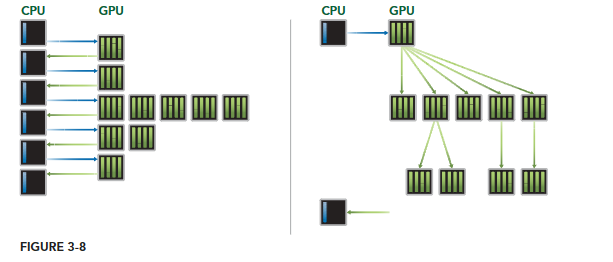
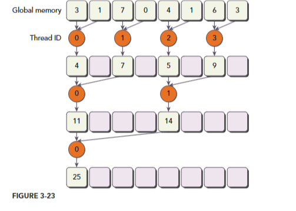

# Resume Of Professional CUDA C Programming Chptrs 3-4

## Overall Overview
**Chapter 3:** focuses on the CUDA execution model and the common limiters to kernel performance, such as memory bandwidth, compute resources, and instruction and memory latency. It emphasizes the importance of understanding hardware resources to improve kernel performance.

**Chapter 4:** delves into the topic of global memory in CUDA programming. It explains the CUDA memory model and explores different global memory access patterns. The chapter also covers memory management, memory allocation and deallocation, memory transfer, and performance tuning techniques related to global memory.

## Overall Key points
### Chapter 3:
- The CUDA execution model has three common limiters to kernel performance: memory bandwidth, compute resources, and instruction and memory latency.
- Understanding hardware resources is crucial for optimizing kernel performance.
- Knowledge of the GPU architecture enables better code writing and utilization of device capabilities.

### Chapter 4:
- The CUDA memory model unifies host and device memory systems and allows explicit control over data placement for optimal performance.
- Applications often exhibit temporal and spatial locality, which can be leveraged for efficient memory access.
- The chapter covers various global memory access patterns, including aligned and coalesced access, and discusses performance tuning techniques for maximizing memory bandwidth.

## Chapter 3: Kuda Execution Model
3.1 Introducing the CUDA Execution Model <br>
The CUDA execution model provides an operational view of how instructions are executed on a specific computing architecture. It exposes an abstract view of the GPU parallel architecture, allowing developers to reason about thread concurrency. The execution model consists of two primary abstractions: a memory hierarchy and a thread hierarchy. The memory hierarchy allows for efficient memory accesses, while the thread hierarchy enables control over the massively parallel GPU.

3.2 Understanding The Nature of Warp Execution <br>
In this section, the document explains the concept of warp execution in detail. It starts by introducing the idea of warps, which are groups of 32 threads that are executed together on a single execution unit called a Streaming Multiprocessor (SM). The document emphasizes that while threads within a warp are logically executed in parallel, not all threads can physically execute in parallel at the same time.

3.3 Exposing Parallelism <br>
It explains that dynamic parallelism allows for the creation of new work directly from the GPU, enabling the expression of recursive or data-dependent parallel algorithms in a more natural and easy-to-understand way. The document also mentions that attention must be given to the child grid launch strategy, parent-child synchronization, and the depth of nested levels when implementing an efficient nested kernel. It highlights that the maximum number of kernel nestings will likely be limited due to the device runtime system reserving extra memory at each nesting level. The document emphasizes the importance of synchronization for both performance and correctness and suggests that reducing the number of in-block synchronizations can lead to more efficient nested kernels. It concludes by stating that dynamic parallelism offers the ability to adapt to data-driven decisions or workloads by making launch configuration decisions at runtime on the device.

3.4 Avoid Branch Divergence <br>
Branch divergence refers to the situation where threads within a warp take different code paths. When threads in a warp diverge, the warp serially executes each branch path, disabling threads that do not take that path. This can result in degraded performance as the amount of parallelism within the warp is reduced.

3.5 Unrolling Loops <br>
Loop unrolling is a technique used to improve the performance of loops in CUDA programming. It involves replicating the body of the loop multiple times, reducing the number of iterations and improving instruction throughput. Unrolling loops can be effective for sequential array processing loops where the number of iterations is known prior to execution.

3.6 Dynamic Paralellism <br>
Dynamic Parallelism is a feature introduced in CUDA that allows the GPU to launch new grids dynamically. It enables the GPU to launch nested kernels, eliminating the need for communication with the CPU. With dynamic parallelism, any kernel can launch another kernel and manage any inter-kernel dependencies needed to perform additional work.

## Chapter 4: Global Memory
4.1 Introducing the CUDA memory model <br>
The CUDA memory model is a key aspect of programming with CUDA. It unifies the separate host and device memory systems and exposes the full memory hierarchy, allowing programmers to explicitly control data placement for optimal performance. The memory model provides a way to manage memory access and achieve optimal latency and bandwidth given the hardware memory subsystem.

4.2 Memory Management <br>
The CUDA memory model provides a unified memory hierarchy that allows explicit control over data placement for optimal performance. Memory management plays a crucial role in high-performance computing on modern accelerators. The memory hierarchy consists of separate host and device memory systems, and the CUDA memory model exposes this hierarchy to the programmer.

4.3 Memory Access Patterns <br>
Optimizing memory access patterns is crucial for maximizing global memory throughput and improving kernel performance. Aligned and coalesced memory accesses are preferred, especially for cached loads and global memory writes, as they minimize wasted bandwidth and maximize bus utilization.

4.4 What bandwidth Can a Kernel Achieve <br>
this section provides insights into the factors affecting kernel performance, such as memory latency, memory bandwidth, block size, and different transpose techniques. It emphasizes the importance of optimizing these factors to achieve the best possible bandwidth for a kernel.

4.5 Matrix Addition with unified memory <br>
Unified Memory is a feature introduced in CUDA 6.0 that simplifies memory management in the CUDA programming model. It creates a pool of managed memory that can be accessed by both the CPU and GPU using the same memory address. This eliminates the need for explicit memory copies and allows for easier management of memory allocations.

## Further Chapter 3 Explanation
### 3.1.1 GPU Architectur Overview:
The GPU architecture is built around a scalable array of Streaming Multiprocessors (SM). Each SM is designed to support concurrent execution of hundreds of threads. When a kernel grid is launched, the thread blocks of that kernel grid are distributed among available SMs for execution. The GPU architecture also employs a Single Instruction Multiple Thread (SIMT) architecture to manage and execute threads in groups of 32 called warps. All threads in a warp execute the same instruction at the same time. The Fermi architecture, in particular, features up to 512 accelerator cores called CUDA cores and has six 384-bit GDDR5 DRAM memory interfaces supporting up to a total of 6 GB of global on-board memory.


### 3.1.2 The Fermi Architecture:
The Fermi architecture is a GPU computing architecture that was the first to deliver the features required for demanding high-performance computing (HPC) applications. It features up to 512 accelerator cores called CUDA cores, organized into 16 streaming multiprocessors (SM) with 32 CUDA cores each. Fermi also has six 384-bit GDDR5 DRAM memory interfaces supporting up to 6 GB of global on-board memory. It includes a GigaThread engine for distributing thread blocks to the SM warp schedulers. Fermi supports concurrent kernel execution, allowing multiple kernels to be run on the device at the same time.

### 3.1.3 the Kepler Architecture:
- The Kepler GPU architecture, released in the fall of 2012, is a fast and highly efficient, high-performance computing architecture. It introduces several important innovations, including enhanced streaming multiprocessors (SMs), dynamic parallelism, and Hyper-Q.
- The Kepler architecture features 15 streaming multiprocessors (SMs) and six 64-bit memory controllers. It offers improved programmability and power efficiency compared to previous architectures. The SM units in Kepler have several architectural innovations that enhance performance and power efficiency.
- Dynamic parallelism is a key feature introduced with Kepler GPUs. It allows the GPU to dynamically launch new grids and enables any kernel to launch another kernel. This feature simplifies the creation and optimization of recursive and data-dependent execution patterns.
- Hyper-Q is another innovation in the Kepler architecture. It adds more simultaneous hardware connections between the CPU and GPU, allowing CPU cores to run more tasks on the GPU simultaneously. This increases GPU utilization and reduces CPU idle time.
- Overall, the Kepler architecture provides improved performance, power efficiency, and programmability, making it a valuable choice for high-performance computing applications.

 
<br>


### 3.1.4 Profile-Driven Optimization:
Profile-Driven Optimization is the act of analyzing program performance by measuring various factors such as the space or time complexity of application code, the use of particular instructions, and the frequency and duration of function calls. It is a critical step in program development, especially for optimizing HPC (High-Performance Computing) application code. By using profiling tools, developers can identify performance bottlenecks and gain insight into how compute resources are being utilized in CUDA programming. Profiling tools like nvvp and nvprof provide deep insight into kernel performance and help in identifying bottlenecks and guiding optimizations.

### 3.2.1 Warps and thread Blocks:
Warps and thread blocks are fundamental concepts in CUDA execution model. A thread block is a collection of threads organized in a 1D, 2D, or 3D layout. From the hardware perspective, a thread block is a 1D collection of warps. Each thread block consists of multiple warps, and each warp consists of 32 consecutive threads. All threads within a warp execute the same instruction in a Single Instruction Multiple Thread (SIMT) fashion.

- **Thread Block Configuration** <br>
Thread blocks can be configured to be one-, two-, or three-dimensional. However, from the hardware perspective, all threads are arranged one-dimensionally. Each thread has a unique ID in a block, and for a one-dimensional thread block, the unique thread ID is stored in the CUDA built-in variable threadIdx.x. Threads with consecutive values for threadIdx.x are grouped into warps.

- **Warp Divergence** <br>
Warp divergence occurs when threads within a warp take different paths through an application. This can happen when there are conditional branches in the code. If threads in the same warp diverge, the warp serially executes each branch path, disabling threads that do not take that path. Warp divergence can significantly degrade performance as it reduces the amount of parallelism within a warp.

- **Synchronization and Hazards** <br>
Threads within a thread block can share data through shared memory and registers. However, when sharing data between threads, it is important to avoid race conditions or hazards. Race conditions occur when multiple threads access the same memory location in an unordered manner. Proper synchronization techniques, such as using synchronization barriers, can be used to coordinate communication between threads and avoid race conditions.

- **Resource Limits and Occupancy** <br>
There are resource limits imposed on thread blocks, such as the maximum number of threads per block, maximum number of concurrent warps per multiprocessor, and maximum amount of shared memory per multiprocessor. Achieving high occupancy, which refers to the number of concurrent threads or warps per SM, is important for performance optimization. However, full occupancy is not the only goal, and other factors need to be considered for performance tuning.

- **Conclusion** <br>
Understanding the nature of warp execution and thread block configuration is crucial for efficient CUDA programming. It is important to minimize warp divergence, avoid race conditions, and optimize resource usage to achieve high performance.


### 3.2.2 Warp Divergence:
Warp divergence occurs when threads within a warp take different code paths. This can happen when threads in a warp execute different instructions based on conditional statements. When warp divergence occurs, the warp serially executes each branch path, disabling threads that do not take that path. This can result in degraded performance as the amount of parallelism in the warp is reduced. It is important to avoid different execution paths within the same warp to obtain the best performance. <br>
- Warp divergence happens when threads within a warp take different code paths.
- Threads in a warp must execute the same instruction on each cycle.
- If threads of a warp diverge, the warp serially executes each branch path, disabling threads that do not take that path.
- Warp divergence can cause significantly degraded performance as the amount of parallelism in the warp is reduced.
- Different conditional values in different warps do not cause warp divergence.

### 3.2.3 Resource Partitioning:
Resource partitioning is an important consideration in CUDA programming. It involves managing the compute resources available on the GPU to maximize performance. The number of active warps is limited by the compute resources, so it is crucial to be aware of the hardware restrictions and the resources used by the kernel. By maximizing the number of active warps, the GPU utilization can be maximized as well.
- **Partition Camping** <br>
Partition camping is a phenomenon that can occur when accessing global memory. It refers to the situation where memory requests are queued at some partitions while other partitions remain unused. This can lead to suboptimal performance. To improve performance, it is recommended to evenly divide the concurrent access to global memory among partitions. This can be achieved by adjusting the block execution order or using diagonal block coordinate mapping.

- **Guidelines for Improving Bandwidth Utilization** <br>
To improve bandwidth utilization, two guidelines are provided. First, maximize the number of concurrent memory accesses in-flight. This can be done by creating more independent memory requests in each thread or adjusting the grid and block execution configuration. Second, maximize the utilization of bytes that travel on the bus between global memory and on-chip memory. This can be achieved by striving for aligned and coalesced memory accesses.

- **Understanding the Nature of Warp Execution** <br>
When launching a kernel, threads in the kernel run in parallel from a logical point of view. However, not all threads can physically execute in parallel at the same time. Warps are the basic unit of execution in an SM, and threads within a warp are executed in groups of 32. It is important to understand warp execution from the hardware perspective to guide kernel design and optimize performance.

- **CUDA Memory Model** <br>
The CUDA memory model unifies the host and device memory systems and allows explicit control over data placement for optimal performance. It exposes the full memory hierarchy and provides benefits such as improved latency and bandwidth. Applications often exhibit temporal and spatial locality, and the memory hierarchy takes advantage of this by providing progressively lower-latency but lower-capacity memory levels. By understanding the memory model, developers can efficiently use global memory in their kernels.

### 3.2.4 Latency Hiding:
Latency hiding is a crucial concept in CUDA programming that allows GPUs to maximize their utilization and throughput. It involves hiding the latency of instructions by executing other instructions from different resident warps. GPUs are designed to handle a large number of concurrent and lightweight threads, which enables them to hide instruction latency effectively. 

- Latency hiding in CUDA programming is achieved by executing instructions from different resident warps.
- GPUs are designed to handle a large number of concurrent and lightweight threads to maximize throughput.
- Instruction latency can be classified into arithmetic instruction latency and memory instruction latency.
- Arithmetic instruction latency is the time between an arithmetic operation starting and its output being produced.
- Memory instruction latency is the time between a load or store operation being issued and the data arriving at its destination.
- GPUs can hide arithmetic instruction latency more effectively than memory instruction latency.
- The number of active warps per SM plays a crucial role in latency hiding.
- Little's Law can be used to estimate the number of active warps required to hide latency.
- Choosing an optimal execution configuration is important to strike a balance between latency hiding and resource utilization.

### 3.2.5 Occupancy:
Occupancy refers to the ratio of active warps to the maximum number of warps per Streaming Multiprocessor (SM) in a GPU. It is an important metric for optimizing performance in CUDA applications. Achieving high occupancy allows for better utilization of compute resources and can lead to improved performance. However, it is important to note that higher occupancy does not always guarantee higher performance, as other factors can also impact performance.

- Occupancy is the ratio of active warps to the maximum number of warps per SM.
- Higher occupancy allows for better utilization of compute resources.
- Achieving high occupancy can lead to improved performance in CUDA applications.
- However, higher occupancy does not always equate to higher performance, as other factors can also impact performance.

### 3.2.6 Synchronization:
Synchronization in CUDA refers to the coordination of threads in a thread block during the execution of a kernel. It allows threads to wait for each other to reach a specific point in their execution before proceeding further. There are two levels of synchronization in CUDA: system-level and block-level.

**System-level Synchronization**
System-level synchronization involves waiting for all work on both the host and the device to complete. This can be achieved using the 
```CUDA
cudaError_t cudaDeviceSynchronize(void);
```
function, which blocks the host application until all CUDA operations have completed. It ensures that all asynchronous CUDA operations, such as memory copies and kernel launches, have finished before the host continues its execution.

**Block-level Synchronization**
Block-level synchronization, on the other hand, involves waiting for all threads in a thread block to reach the same point in their execution on the device. This is done using the
```CUDA 
__device__void__syncthreads(void);
```
 function, which is called within a kernel. When ``` __syncthreads ``` is called, each thread in the same thread block must wait until all other threads in that block have reached the synchronization point. This ensures that all global and shared memory accesses made by the threads prior to the synchronization point are visible to all other threads in the block after the synchronization.

### 3.2.7 Scalability:
Scalability is a desirable feature in parallel applications as it allows for improved performance by adding additional hardware resources. In the context of CUDA applications, scalability means that running the application on multiple Streaming Multiprocessors (SMs) can halve the execution time compared to running on a single SM. Scalable parallel programs efficiently utilize all compute resources to enhance performance. Scalability is important as it allows for the execution of the same application code on varying numbers of compute cores, known as transparent scalability, reducing the burden on developers and broadening the use-cases for existing applications.

**Scalability in CUDA Programs** <br>
When a CUDA kernel is launched, thread blocks are distributed among multiple SMs, and these blocks can be executed in any order, either in parallel or in series. This independence of execution allows CUDA programs to scale across an arbitrary number of compute cores. For example, a GPU with two SMs can execute two blocks simultaneously, while a GPU with four SMs can execute four blocks at the same time. This scalability is achieved without requiring any code changes, as the execution time of the application scales according to the available resources.

### 3.3.1 Checking Active Warps with nvprof:
Process of checking active warps using nvprof, a profiling tool in CUDA programming. It explains that active warps are the warps that have been allocated compute resources and are ready for execution. The document provides examples of different thread block configurations and their corresponding achieved occupancy values, which indicate the ratio of active warps to the maximum number of warps supported on a streaming multiprocessor (SM). It also highlights that achieving higher occupancy does not always guarantee better performance and that other factors can restrict performance.

### 3.3.2 Checking Memory Operations with nvprof:
Analyze memory operations in CUDA programs. It mentions the use of metrics such as "gld_throughput" and "gld_efficiency" to measure memory read efficiency and global load efficiency, respectively. The text provides examples of using nvprof to check these metrics for different execution configurations of a kernel. It also highlights the importance of load efficiency and how it can impact performance. Additionally, the text mentions the use of nvvp, a visual profiler, to inspect unified memory performance and measure unified memory traffic.

### 3.3.3 Exposing more Parallelism
It explains that dynamic parallelism allows for the creation of new work directly from the GPU, enabling the expression of recursive or data-dependent parallel algorithms in a more natural and easy-to-understand way. By using dynamic parallelism, the decision of how many blocks and grids to create on the GPU can be postponed until runtime, allowing for better utilization of GPU hardware schedulers and load balancers. This can lead to improved performance and adaptability in response to data-driven decisions or workloads. The document also mentions that the ability to create work directly from the GPU reduces the need to transfer execution control and data between the host and device.

### 3.4.1 The parallel Reduction Problem
The parallel reduction problem involves calculating the sum of an array of integers in parallel. Instead of sequentially adding each element, the array can be divided into smaller chunks and each thread can calculate the partial sum for its chunk. The partial results from each chunk are then added together to obtain the final sum. This approach takes advantage of the associative and commutative properties of addition to perform parallel addition efficiently.


### 3.4.2 Divergence in Parallel Reduction
Divergence refers to the situation where threads within a warp take different execution paths. This can happen when there is conditional execution within a warp, leading to poor kernel performance. To avoid divergence, techniques such as rearranging data access patterns can be used. One approach is the neighbored pair implementation, where each thread adds two adjacent elements to produce a partial sum. Another approach is the interleaved pair implementation, where paired elements are separated by a given stride. These techniques help reduce or eliminate warp divergence and improve the performance of parallel reduction kernels.


### 3.4.3 Improving Divergence in Parallel Reduction
To improve divergence, the array index of each thread can be rearranged to force neighboring threads to perform the addition. This reduces divergence and improves the efficiency of the parallel reduction algorithm. The implementation involves setting the array access index for each thread and using conditional statements to ensure that only certain threads perform the addition. By reducing divergence, the parallel reduction algorithm can achieve better performance.



### 3.4.4 Reducing with Interleaved Pairs
Reducing with interleaved pairs involves pairing elements in a given stride. This implementation allows a thread to take two adjacent elements and produce one partial sum at each step. For an array with N elements, this approach requires N - 1 sums and log2N steps. The inputs to a thread in this implementation are strided by half the length of the input on each step. The kernel code for interleaved reduction is provided in the document.


### 3.5.1 Reducing With Unrolling
Unrolling loops is a technique used to optimize loop execution by reducing the frequency of branches and loop maintenance instructions. It involves writing the body of a loop multiple times instead of using a loop to execute it repeatedly. The number of copies made of the loop body is called the loop unrolling factor. Unrolling loops can improve performance for sequential array processing loops where the number of iterations is known prior to execution of the loop.

In the context of CUDA programming, unrolling loops can be used to improve performance by reducing instruction overheads and creating more independent instructions to schedule. This leads to higher saturation of instruction and memory bandwidth, resulting in more concurrent operations and better performance. Unrolling can be done in different ways, such as unrolling two data blocks by a single thread block or unrolling warps. The choice of unrolling technique depends on the specific requirements of the application.

### 3.5.2 Reducing with Unrolled Warps
Refers to a technique used in CUDA programming to optimize the performance of reduction kernels. It involves unrolling the last few iterations of a reduction loop to avoid executing loop control and thread synchronization logic. By doing so, the compiler can optimize the code and reduce the number of stalls caused by thread synchronization. This technique can lead to improved performance and higher saturation of instruction and memory bandwidth.
### 3.5.3 Reducing with Complete Unrolling
Complete unrolling is a technique used to improve performance in loops where the number of iterations is known at compile-time. By unrolling the loop, the number of times the loop condition is checked is reduced, resulting in fewer instruction overheads. Additionally, the memory operations within each iteration can be issued simultaneously, further improving performance. In CUDA, complete unrolling can be achieved by manually unrolling the loop and performing in-place reduction. This technique can lead to higher saturation of instruction and memory bandwidth, resulting in improved performance.

### 3.5.4 Reducing with Template Functions
Discusses the use of template functions to further reduce branch overhead in parallel reduction. It explains that CUDA supports template parameters on device functions, allowing the block size to be specified as a parameter of the template function. The code example provided demonstrates the use of template functions to implement a parallel reduction kernel with complete loop unrolling. The performance improvement achieved by this approach is also mentioned in the document.

### 3.6.1 Nested Execution
Nested execution refers to the ability to create new work directly from the device, enabling the expression of recursive or data-dependent parallel algorithms in a more natural and easy-to-understand way. It involves launching child grids from within a kernel, which can have multiple levels of nesting. The depth of nested levels and the strategy for launching child grids are important considerations for implementing efficient nested kernels.

- Nested execution allows for the creation of new work directly from the device.
- It enables the expression of recursive or data-dependent parallel algorithms.
- Child grids can be launched from within a kernel, resulting in multiple levels of nesting.
- The depth of nested levels and the strategy for launching child grids are important for efficient implementation.

### 3.6.2 Nested Hello World on the GPU
The concept of dynamic parallelism is introduced in this section, where a kernel is created to print "Hello World" using nested, recursive execution. The parent grid is invoked by the host with 8 threads in a single thread block. Thread 0 in the parent grid then invokes a child grid with half as many threads. This process continues recursively until only one thread is left in the final nesting. The output of the nested kernel program is shown, indicating the recursion depth and the execution from each thread and block.

### 3.6.3 Nested Reduction
Nested reduction is a technique used in parallel computing to perform a reduction operation on a large array of data elements. It involves dividing the input vector into smaller chunks and having each thread calculate the partial sum for its chunk. The partial results from each chunk are then added together to obtain the final sum. This approach reduces or avoids warp divergence, which can negatively impact kernel performance. Different implementations of nested reduction, such as the neighbored pair and interleaved pair approaches, can be used depending on the specific requirements of the reduction operation.

### Chapter 3 Summary
The CUDA execution model on GPU devices has two key features: threads are executed in warps in a Single Instruction Multiple Thread (SIMT) fashion, and hardware resources are partitioned among blocks and threads. These features allow you to control how your application utilizes instruction and memory bandwidth to increase parallelism and performance. Different GPU devices have different hardware limits, so grid and block heuristics are important for optimizing kernel performance. Dynamic parallelism enables the creation of new work directly from the device, allowing for the expression of recursive or data-dependent parallel algorithms. Implementing efficient nested kernels requires attention to the device runtime, including the child grid launch strategy, parent-child synchronization, and the depth of nested levels. In this chapter, you also learned how to analyze kernel performance using the command-line profiling tool, nvprof. Profiling is crucial in CUDA programming to identify performance bottlenecks and optimize kernel behavior.

## Further Chapter 4 Explanation

### 4.1.1 Benefits of a Memory Hierarchy
A memory hierarchy in modern computers consists of multiple levels of memory with different latencies, bandwidths, and capacities. The memory hierarchy is designed to optimize performance by utilizing the principle of locality. The benefits of a memory hierarchy include lower cost per bit, higher capacity, and the ability to store data that is less frequently accessed by the processor. This hierarchy allows for the efficient use of memory resources and can provide the illusion of large but low-latency memory.

### 4.1.2 CUDA Memory Model
The CUDA memory model is designed to provide programmers with more control over data movement and placement, allowing for more aggressive optimizations and higher peak performance. It exposes the programmer to the GPU memory hierarchy, which includes various types of programmable and non-programmable memory.

**Programmable Memory** <br>
Programmable memory in the CUDA memory model includes registers, shared memory, local memory, constant memory, texture memory, and global memory. Each type of memory has a different scope, lifetime, and caching behavior. For example, registers are private to each thread in a kernel, while shared memory is visible to all threads in a thread block.

**Non-programmable Memory** <br>
Non-programmable memory in the CUDA memory model includes L1 cache and L2 cache. These memory spaces are not directly controlled by the programmer and rely on automatic techniques for data placement and caching.

**Memory Management** <br>
To achieve maximum performance, CUDA provides functions for allocating and deallocating device memory, as well as transferring data between the host and device. Manual data movement is still required in most applications, although NVIDIA is working towards unifying the host and device memory space with each CUDA release.

**Memory Access Patterns** <br>
Efficiently accessing global memory is crucial for optimizing performance in CUDA applications. Different global memory access patterns can have a significant impact on performance. It is important to consider factors such as aligned and coalesced access, as well as the use of shared memory to reduce global memory access.

**Global Memory** <br>
Global memory is the largest and most commonly used memory in CUDA. It has high latency and can be accessed through 32-byte or 128-byte transactions. Understanding the characteristics and granularities of global memory is important for optimizing its usage in applications.

### 4.2.1 Memory Allocation and Deallocation
The CUDA programming model assumes a heterogeneous system with a host and a device, each having its own separate memory space. Kernel functions operate in the device memory space, and the CUDA runtime provides functions to allocate and deallocate device memory.

You can allocate global memory on the host using the ```cudaMalloc``` function. This function allocates a specified number of bytes of global memory on the device and returns the location of that memory in a pointer. The allocated memory is suitably aligned for any variable type.

To initialize the allocated global memory, you can use the ```cudaMemset``` function. This function fills a specified number of bytes starting at a device memory address with a specified value.

Once an application is no longer using a piece of allocated global memory, it can be deallocated using the ```cudaFree``` function. This function frees the global memory pointed to by a pointer, which must have been previously allocated using a device allocation function.

Device memory allocation and deallocation are expensive operations, so it is recommended to reuse device memory whenever possible to minimize the impact on overall performance.

### 4.2.2 Memory Transfer
In CUDA programming, once global memory is allocated, data can be transferred between the host and the device using the ```cudaMemcpy``` function. This function copies a specified number of bytes from the source memory location to the destination memory location. The direction of the copy is determined by the ```cudaMemcpyKind``` parameter, which can have values such as ```cudaMemcpyHostToDevice``` and ```cudaMemcpyDeviceToHost```. 

It's important to ensure that the pointers for the source and destination memory locations match the specified copy direction. The ```cudaMemcpy``` function exhibits synchronous behavior in most cases. An example of using ```cudaMemcpy``` for memory transfer is shown in Listing 4-2, where data is transferred back and forth between the host and the device.

### 4.2.3 Pinned Memory
By default, allocated host memory is pageable, which means that it can be subject to page fault operations that move data in host virtual memory to different physical locations as directed by the operating system.

**Key points**
- Pageable host memory is subject to page fault operations that can move data in host virtual memory.
- The CUDA driver first allocates temporary page-locked or pinned host memory when transferring data from pageable host memory to device memory.
- Pinned host memory, on the other hand, is page-locked and accessible directly by the device, providing higher transfer throughput for large data transfers.
- However, allocating excessive amounts of pinned memory can degrade host system performance by reducing the amount of pageable memory available for storing virtual memory data.

### 4.2.4 Zero-Copy Memory
Zero-copy memory is a memory management technique in CUDA that allows data to be shared between the host and device without the need for explicit data transfers. It is particularly useful in integrated architectures where CPUs and GPUs share main memory. Zero-copy memory simplifies programming and offers reasonable performance for small amounts of data. However, for larger datasets with discrete GPUs connected via the PCIe bus, zero-copy memory can cause significant performance degradation.

**Key points**
- Zero-copy memory allows data to be shared between the host and device without explicit data transfers.
- It is beneficial in integrated architectures where CPUs and GPUs share main memory.
- Zero-copy memory simplifies programming and offers reasonable performance for small amounts of data.
- For larger datasets with discrete GPUs connected via the PCIe bus, zero-copy memory can cause significant performance degradation.

### 4.2.5 Unified Virtual Addressing
Unified Virtual Addressing (UVA) is a special addressing mode introduced in CUDA 4.0. It allows host memory and device memory to share a single virtual address space. Prior to UVA, developers had to manage pointers to host memory and device memory separately. With UVA, the memory space referenced by a pointer becomes transparent to application code. This simplifies memory management and allows for easier passing of pointers to kernel functions. UVA is supported on 64-bit Linux systems.

### 4.2.6 Unified Memory
Unified Memory is a feature introduced in CUDA 6.0 that simplifies memory management in the CUDA programming model. It creates a pool of managed memory where allocations are accessible on both the CPU and GPU with the same memory address. The underlying system automatically migrates data between the host and device, making data movement transparent to the application.

**Key points**
- Unified Memory eliminates the need for explicit data transfers between the host and device.
- It relies on Unified Virtual Addressing (UVA) support to provide a single virtual memory address space for all processors.
- Unified Memory offers a "single-pointer-to-data" model, similar to zero-copy memory, but with improved performance.
- It simplifies CUDA programming by automatically managing memory allocations and data movement.
- Future hardware and software enhancements are expected to further improve Unified Memory performance.

### 4.3.1 Aligned and Coalesced Access
Aligned and coalesced memory accesses are important for maximizing global memory throughput in GPU applications. Aligned memory accesses occur when the first address of a device memory transaction is an even multiple of the cache granularity being used (either 32 bytes for L2 cache or 128 bytes for L1 cache). Coalesced memory accesses occur when all threads in a warp access a contiguous chunk of memory. Aligned coalesced memory accesses are ideal, as they allow for efficient use of memory bandwidth. To achieve optimal global memory access, it is important to organize memory operations to be both aligned and coalesced.

### 4.3.2 Global Mamory Reads
Global memory reads in CUDA involve accessing data from the global memory of the GPU. This chapter discusses the optimization of global memory accesses to improve performance.

**Key points**
- Global memory reads can be pipelined through different cache/buffer paths, including L1/L2 cache, constant cache, and read-only cache.
- The L1 cache can be enabled or disabled depending on the device compute capability and compiler options.
- Aligned and coalesced memory accesses are important for reducing wasted bandwidth and improving throughput efficiency.
- The number of transactions required for a memory request depends on the distribution and alignment of memory addresses.
- GPU caches, including L1 and L2 caches, are used to store data in local and global memory, improving read performance.
- The CUDA memory model allows explicit control over data placement for optimal performance.

### 4.3.3 Global Memory Writes
Global memory writes in CUDA refer to the process of storing data from the device to the global memory. It is important to optimize global memory writes to improve performance and efficiency in GPU computing.

**Key points**
- Aligned and coalesced memory accesses are crucial for efficient global memory writes. This means that memory accesses should be aligned to the size of the memory transaction and should be consecutive.
- Misaligned memory writes can lead to reduced performance and wasted bandwidth.
- The number of transactions required to satisfy a memory write request depends on the distribution of memory addresses across threads and the alignment of memory addresses per transaction.
- The CUDA memory model unifies host and device memory systems, allowing explicit control over data placement for optimal performance.
- GPU caches, such as L1 and L2 caches, are used to store data in local and global memory, including register spills, and can improve memory access efficiency.
- Unified Memory in CUDA simplifies programming by eliminating the need for explicit data transfers between the host and device, maintaining coherency between them.
- Optimizing memory transactions and maximizing global memory throughput efficiency are important for achieving optimal performance in GPU computing.

### 4.3.4 Array of Structures Versus Structures of Arrays
The document discusses two ways of organizing data: Array of Structures (AoS) and Structure of Arrays (SoA). In the AoS approach, data elements are stored in a structure and then organized in an array. This approach is beneficial for cache locality on the CPU as related data is stored close together. On the other hand, the SoA approach separates the values of each field into their own arrays. This allows for storing data for neighboring data points together, but a single data point is spread across multiple arrays. The choice between AoS and SoA depends on the specific requirements and performance considerations.

### 4.3.5 Performace tuning
Performance tuning is an important aspect of optimizing kernel performance in CUDA programming. It involves finding a good balance among various metrics and events to achieve the best overall performance. No single metric can prescribe optimal performance, and the choice of metric depends on the nature of the kernel code. Understanding hardware resources and the nature of warp execution is crucial for improving kernel performance. Profiling tools like nvprof can provide deep insights into kernel performance and help identify bottlenecks.

**Key points**
- Performance tuning requires finding a balance among related metrics and events.
- No single metric can prescribe optimal performance, and it depends on the nature of the kernel code.
- Understanding hardware resources is important for improving kernel performance.
- Profiling tools like nvprof provide insights into kernel performance and help identify bottlenecks.

### 4.4.1 Memory Bandwidth
Memory bandwidth is an important factor in kernel performance. It refers to the rate at which device memory can be accessed by a streaming multiprocessor (SM), measured in bytes per time unit. There are two types of memory bandwidth: theoretical bandwidth and effective bandwidth. Theoretical bandwidth is the maximum achievable bandwidth with the hardware, while effective bandwidth is the measured bandwidth that a kernel actually achieves. Memory bandwidth can be affected by how data in global memory is arranged and accessed by a warp.

**Key points**
- Memory bandwidth is the rate at which device memory can be accessed by an SM.
- Theoretical bandwidth is the maximum achievable bandwidth with the hardware.
- Effective bandwidth is the measured bandwidth that a kernel actually achieves.
- Memory bandwidth can be affected by data arrangement and warp access patterns in global memory.

### 4.4.2 Matrix Transpose Problem
The matrix transpose is a fundamental problem in linear algebra, where each row of a matrix is exchanged with its corresponding column. This operation is commonly used in various applications. The given document provides an example of a host-based implementation of an out-of-place transpose algorithm using single-precision floating-point values. The transpose is calculated by transforming array index values to reverse row and column coordinates. The document also discusses the data layout of the original matrix and the transposed matrix, highlighting the access patterns for reads and writes. Additionally, it explores the impact of enabling or disabling L1 cache on the performance of transpose kernels. The document presents different kernel implementations and their effective bandwidths, comparing their performance to upper and lower bounds. It concludes that the Unroll4Col kernel demonstrates the best performance, achieving an effective bandwidth of 60 to 80 percent of the peak bandwidth


## Reflexion
### Chapter 3: CUDA Execution Model

In Chapter 3, the focus is on developing kernels with a profile-driven approach and understanding the nature of warp execution. It explains how to expose more parallelism to the GPU and master grid and block configuration heuristics. The chapter also covers various CUDA performance metrics and events, as well as dynamic parallelism and nested execution.

The chapter provides guidelines for selecting grid and block configurations, helping to optimize kernel performance. It emphasizes the importance of understanding hardware resources and the GPU architecture to write better code and fully exploit the device's capability. The chapter also delves into the concept of warp execution and how threads are grouped into warps.

### Chapter 4: Global Memory

Chapter 4 focuses on the CUDA memory model and programming with global memory. It explores global memory access patterns and the impact of memory efficiency on kernel performance. The chapter provides guidelines for improving bandwidth utilization and maximizing the utilization of bytes traveling between global memory and on-chip memory.

The chapter discusses the importance of aligned and coalesced memory accesses and provides techniques for achieving them. It also introduces Unified Memory, which simplifies CUDA programming by eliminating duplicate pointers and the need for explicit data transfer between the host and device.

### Opinion and Conclusion

In my opinion, Chapters 3 and 4 provide valuable insights into optimizing CUDA kernel performance. 

Chapter 3 highlights the importance of understanding the hardware perspective and provides guidelines for selecting grid and block configurations. It also sheds light on the nature of warp execution and how it impacts kernel design.

Chapter 4 delves into the intricacies of global memory and its impact on kernel performance. It emphasizes the importance of memory efficiency, aligned and coalesced memory accesses, and maximizing bandwidth utilization. The introduction of Unified Memory simplifies programming and eliminates the need for explicit data transfer.

Parallelism and Performance: The execution model allows threads to be executed in warps, maximizing parallelism and performance. This SIMT (Single Instruction, Multiple Threads) fashion enables efficient utilization of hardware resources, leading to faster execution of kernels.

Hardware Perspective: The execution model exposes the hardware perspective, allowing developers to understand the underlying architecture and optimize their code accordingly. By considering hardware resources, cache characteristics, and memory access patterns, developers can write more efficient code and fully exploit the capabilities of the GPU.

Profile-Driven Approach: CUDA programming encourages a profile-driven approach, where developers analyze the performance of their code using profiling tools like nvprof. This approach helps identify performance bottlenecks, understand kernel behavior, and guide optimization efforts, resulting in improved performance.

Dynamic Parallelism: The introduction of dynamic parallelism in CUDA enables the creation of new work directly from the device. This feature allows for the expression of recursive or data-dependent parallel algorithms in a more natural and easy-to-understand way, enhancing code flexibility and maintainability.

Overall, By understanding the CUDA execution model and global memory concepts, I can apply optimization techniques to improve performance in both code and real-life applications. Whether it's optimizing algorithms, improving data access patterns, or maximizing resource utilization, the knowledge gained from these chapters can be valuable in various domains where optimization is key.


## References 

[1] J. Cheng, M. Grossman, and T. McKercher, Professional Cuda C Programming. Indianapolis (Ind.): Wrox, 2014. 
