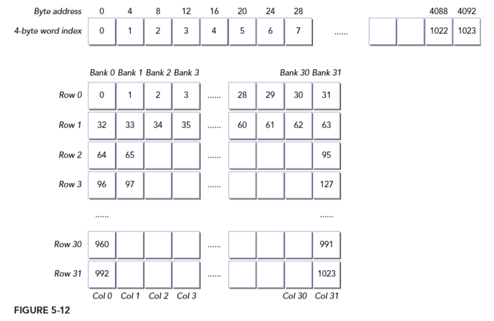
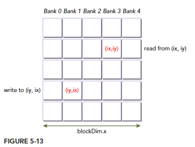
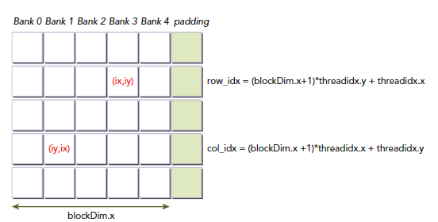

# Summary of Shared Memory
*Professional CUDA C Programming Book Summary on page 216-232*

## Overview
In the document Section "Checking the Data Layout of Shared Memory" discusses the arrangement and optimization of shared memory in CUDA programming. It covers topics such as the layout of shared memory, accessing shared memory efficiently, avoiding bank conflicts, and reducing global memory accesses. The document provides examples and code snippets to illustrate these concepts.

### Key points
1. The document explains how to design an efficient kernel to avoid bank conflicts and fully utilize the benefits of shared memory.

2. It discusses the use of square shared memory to cache global data and the calculation of 1D memory offsets from 2D thread indices..

3. The document highlights the importance of paying attention to how threads map to shared memory banks for better performance.

4. It also introduces the concept of dynamic shared memory and its implementation in CUDA programming.

5. The document provides examples of kernels that write to shared memory in row-major order and read from shared memory in column-major order, and explains how to perform a matrix transpose using shared memory.

6. It discusses the memory transactions and metrics associated with these kernels, such as shared load and store transactions per request.

## Checking the Data layout of shared memory

In this section, the document discusses the layout of shared memory and how it can be utilized efficiently. It explains that shared memory can be used to cache global data with square dimensions, making it easy to calculate 1D memory offsets from 2D thread indices. The document provides an illustration of a shared memory tile with 32 elements in each dimension, stored in row-major order. It also mentions the importance of considering how threads map to shared memory banks

### 1.1 Square Shared Memory:  
Square shared memory is a caching technique used to improve performance by reducing global memory accesses. It involves storing data in a 2D shared memory array with square dimensions. The data is accessed by neighboring threads in either the x or y dimension. By utilizing shared memory, the number of global memory transactions can be reduced, resulting in improved bandwidth utilization and decreased overall memory latency. Padding the shared memory array can further eliminate bank conflicts, optimizing performance.

### 1.2 Rectangular Shared Memory:  
Rectangular shared memory is a more general case of 2D shared memory, where the number of rows and columns in an array are not equal. It allows for more flexibility in storing and accessing data in shared memory. In the given document, there are examples of kernels that use rectangular shared memory arrays with different dimensions. The dimensions of the rectangular shared memory array are defined using macros, and the shared memory tile is allocated accordingly. The document also mentions the need to recalculate access indices based on the matrix dimensions when using rectangular shared memory.

# Further Explanation of Checking the Data layout of shared memory
## 1.1 Square Shared Memory:  
Square shared memory refers to a technique used in GPU programming to cache global data with square dimensions in shared memory. It involves storing data in a two-dimensional array in shared memory, where each element of the array corresponds to a thread in a thread block. The square dimensionality of the array makes it easy to calculate one-dimensional memory offsets from two-dimensional thread indices.

By using square shared memory, neighboring threads within a thread block can access neighboring elements in either the x or y dimension of the shared memory array. This allows for efficient data access and can improve the performance of GPU kernels by reducing global memory access and increasing memory bandwidth utilization.

**Key points**
- Square shared memory is used to cache global data with square dimensions.
- It allows for efficient calculation of 1D memory offsets from 2D thread indices.
- Shared memory is divided into 32 equally-sized memory modules called banks.
- The arrangement of data in shared memory is in row-major order.
- There is a mapping between 4-byte data elements and banks in shared

### 1.1.1 **Accessing Row-Major versus Column-Major:**  
When accessing a square shared memory array in row-major order, the length of the innermost dimension of the shared memory array is set to the same dimension as the innermost dimension of the 2D thread block. This means that neighboring threads in the same warp will access neighboring array cells along the innermost array dimension, resulting in better performance and fewer bank conflicts. On the other hand, when accessing a square shared memory array in column-major order, the length of the innermost dimension of the shared memory array is set to the same dimension as the outermost dimension of the 2D thread block. This means that neighboring threads in the same warp will access neighboring array cells along the outermost array dimension, which can lead to more bank conflicts and potentially lower performance.  
In summary, accessing a square shared memory array in row-major order generally provides better performance and fewer bank conflicts compared to accessing it in column-major order.

### 1.1.2 **Writing Row-Major and Reading Column-Major:**  
In the case of square shared memory, writing in row-major order means that each thread in a warp writes its global thread index to consecutive locations in the shared memory array along the innermost dimension. This allows for consecutive memory accesses and avoids bank conflicts. On the other hand, reading in column-major order means that each thread in a warp reads values from consecutive locations in the shared memory array along the outermost dimension. This can result in bank conflicts, as neighboring threads access neighboring array cells along the outermost dimension.

### 1.1.3 **Dynamic Shared Memory:**  
Dynamic shared memory refers to shared memory that is declared dynamically at runtime. In the context of the square shared memory, you can create a new kernel that declares shared memory dynamically and performs operations such as writing to columns and reading from rows. This allows for more flexibility in memory allocation and can be useful in certain scenarios.

### 1.1.4 **Padding Statically Declared Shared Memory:**  
In square shared memory, padding is used to avoid bank conflicts. To pad statically declared shared memory in square shared memory, we simply add a column to the 2D shared memory allocation. By doing this, the column elements are distributed among different banks, resulting in conflict-free reading and writing operations.

### 1.1.5 **Padding Dynamically Declared Shared Memory:**  
In the case of padding dynamically declared shared memory of square shared memory, one padded memory space is skipped for each row when converting the 2D thread indices to 1D memory indices. This helps in resolving bank conflicts and improves performance by reducing shared memory transactions.

### 1.1.6 **Comparing the Performance of the Square Shared Memory Kernels:**  
When comparing the performance of the square shared memory kernels, it is observed that kernels using padding gain performance due to reduced bank conflicts. On the other hand, kernels with dynamically declared shared memory add a small amount of overhead. By analyzing the elapsed times and memory transactions, it is possible to determine the impact of different optimization techniques on the performance of the square shared memory kernels.

## 1.2 Rectangular Shared Memory:  
Rectangular shared memory is a type of on-chip memory in GPUs that allows threads within the same thread block to cooperate and reduce the global memory bandwidth needed by kernels. It is a program-managed cache that can be used for intra-block thread communication, caching global memory data, and improving global memory access patterns. Rectangular shared memory arrays can be declared statically or dynamically and can be accessed in either row-major or column-major order.

**Key points**
- Rectangular shared memory is a low-latency on-chip memory in GPUs.
- It enables threads within the same thread block to cooperate and reduce global memory bandwidth.
- It can be used for intra-block thread communication and caching global memory data.
- Rectangular shared memory arrays can be declared statically or dynamically.
- Accessing rectangular shared memory can be done in either row-major or column

### 1.2.1 **Accessing Row-Major versus Column-Major:**  
In the case of rectangular shared memory, where the number of rows and columns in an array are not equal, accessing the shared memory array in row-major or column-major order requires different considerations.
When accessing a rectangular shared memory array in row-major order, the length of the innermost dimension of the shared memory array is set to the same dimension as the innermost dimension of the 2D thread block. This allows neighboring threads in the same warp to access neighboring array cells along the innermost array dimension, similar to the square shared memory case.
On the other hand, when accessing a rectangular shared memory array in column-major order, the length of the innermost dimension of the shared memory array is set to the same dimension as the outermost dimension of the 2D thread block. This means that neighboring threads in the same warp will access neighboring array cells along the outermost array dimension, which can lead to more bank conflicts and potentially lower performance.
In summary, similar to the square shared memory case, accessing a rectangular shared memory array in row-major order generally provides better performance and fewer bank conflicts compared to accessing it in column-major order.

### 1.2.2 **Writing Row-Major and Reading Column-Major:**  
In the case of rectangular shared memory, the dimensions of the shared memory array are not equal. Writing in row-major order still means that each thread in a warp writes its global thread index to consecutive locations in the shared memory array along the innermost dimension. This helps avoid bank conflicts. Similarly, reading in column-major order means that each thread in a warp reads values from consecutive locations in the shared memory array along the outermost dimension. However, due to the unequal dimensions, there may still be bank conflicts, especially if neighboring threads access neighboring array cells along the outermost dimension.

### 1.2.3 **Dynamically Declared Shared Memory:**  
In rectangular shared memory, the dimensions of the shared memory array are not equal, which means that the calculation of 1D memory offsets from 2D thread indices is more complex. When using rectangular shared memory, it is necessary to re-implement the kernels and recalculate access indices based on the matrix dimensions. This is because simply switching the thread coordinates used to reference a rectangular array, as done in square shared memory, would result in memory access violations.

### 1.2.4 **Padding Statically Declared Shared Memory:**  
In rectangular shared memory, padding is also used to avoid bank conflicts. To pad statically declared shared memory in rectangular shared memory, we add a column to the 2D shared memory allocation. By doing this, the column elements are distributed among different banks, resulting in conflict-free reading and writing operations.

### 1.2.5 **Padding Dynamically Declared Shared Memory:**  
Padding dynamically declared shared memory of rectangular shared memory is more complex. Similar to square shared memory, one padded memory space is skipped for each row when performing the index conversion from 2D thread indices to 1D memory indices. However, the number of padding elements needed for each row depends on the size of the 2D shared memory. This requires additional testing to determine the proper number of padding elements

### 1.2.6 **Comparing the Performance of the rectangular Shared Memory Kernels:**  
The document discusses the performance of different kernels that utilize rectangular shared memory. The kernels are designed to perform operations such as writing to columns and reading from rows. The performance of these kernels is compared based on factors such as elapsed time and effective bandwidth. It is observed that kernels using padding and unrolling blocks show improved performance due to reduced bank conflicts and increased parallel

## Personal Observations & Reflection

**Square Shared Memory:**
- Square shared memory is used to cache global data with square dimensions.
- It is easy to calculate 1D memory offsets from 2D thread indices in square shared memory.
- The data elements in square shared memory are stored in row-major order.
- Accessing neighboring elements in either the x or y dimension is possible in square shared memory.

**Rectangular Shared Memory:**
- Rectangular shared memory is a more general case of 2D shared memory where the number of rows and columns in an array are not equal.
- Accessing a rectangular shared memory array requires recalculating access indices based on matrix dimensions.
- The length of the innermost dimension of the shared memory array can be different from the innermost dimension of the 2D thread block.
- The data elements in rectangular shared memory can be accessed in either row-major or column-major order.

In summary, the main difference between square shared memory and rectangular shared memory lies in the dimensions and the way data elements are accessed. Square shared memory has equal dimensions and stores data in row-major order, while rectangular shared memory can have different dimensions and allows for both row-major and column-major access.

### **Dynamic Shared Memory:**  
The main difference between dynamic shared memory of square shared memory and rectangular shared memory lies in the calculation of memory offsets and the need for re-implementation in the case of rectangular

### **Padding Statically Declared Shared Memory:**  
The process of padding statically declared shared memory is the same for both square and rectangular shared memory. It involves adding a column to the 2D shared memory allocation to distribute the elements among different banks and avoid bank conflicts.

### **Writing Row-Major and Reading Column-Major:**  
The main difference between writing row-major and reading column-major in both square and rectangular shared memory is the order in which threads access the shared memory array and the potential for bank conflicts. Writing in row-major order allows for consecutive memory accesses and better performance, while reading in column-major order may result in bank conflicts and decreased performance.

## References 

[1] J. Cheng, M. Grossman, and T. McKercher, Professional Cuda C Programming. Indianapolis (Ind.): Wrox, 2014. 
